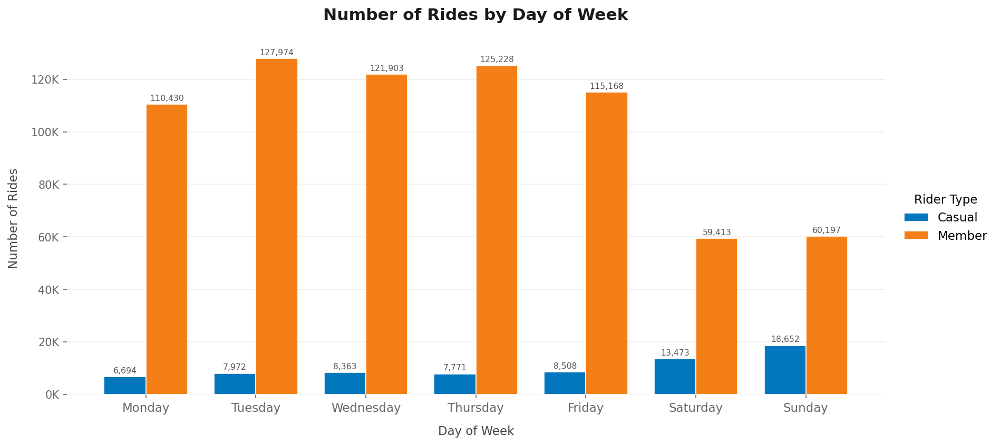
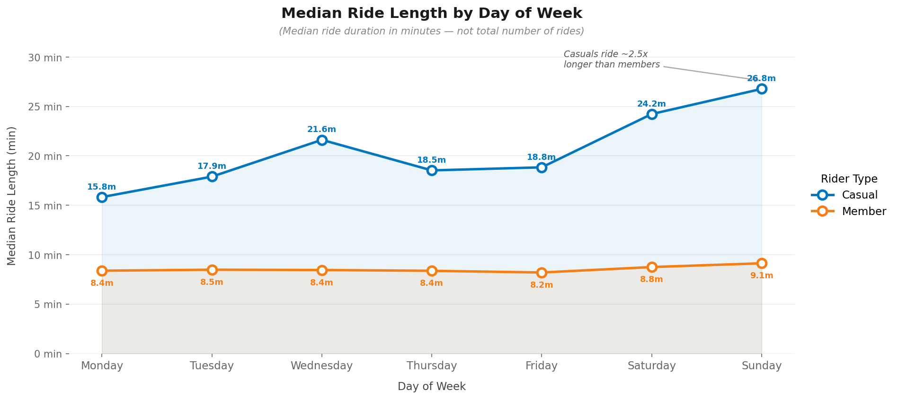
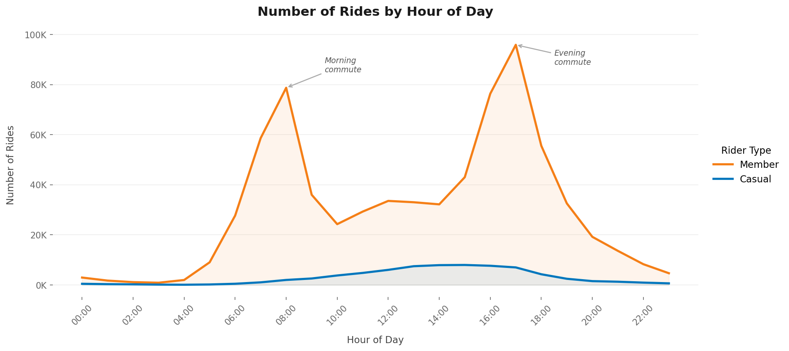
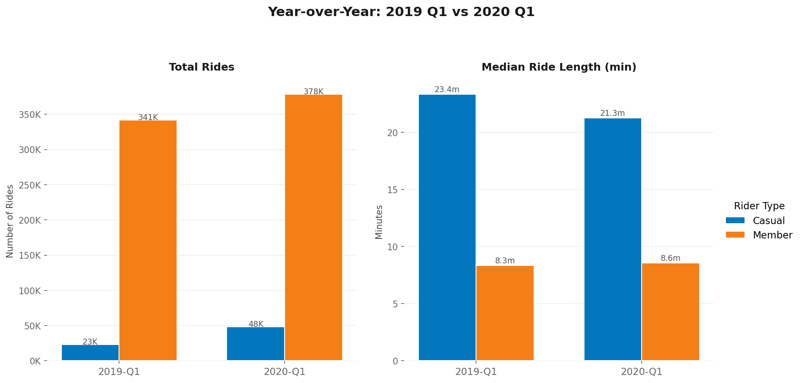
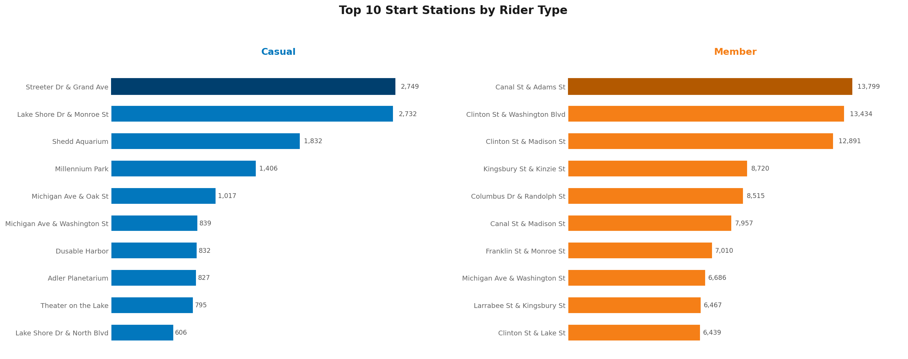

# 🚲 Cyclistic Bike-Share Analysis
### Google Professional Data Analytics Certificate Capstone Case Study

## Overview
This case study analyses how **annual members** and **casual riders** use Cyclistic bike-share services differently, using real trip data from Chicago's Divvy bike-share system. The goal is to provide data-driven recommendations to convert casual riders into annual members.

> **Business Question:** How do annual members and casual riders use Cyclistic bikes differently?

---

## Tools & Technologies
| Tool | Purpose |
|---|---|
| **Google Sheets** | Initial data exploration, calculated fields |
| **SQL (SQLite)** | Data cleaning, transformation, and aggregation |
| **Python** (pandas, matplotlib) | Exploratory analysis and visualisations |
| **Tableau Public** | Interactive executive dashboard |

---

## Data
- **Source:** [Divvy Trip Data](https://divvybikes.com/system-data) - made available by Motivate International Inc. under this [license](https://divvybikes.com/data-license-agreement)
- **Period:** 2019 Q1 & 2020 Q1
- **Size:** 791,746 rides after cleaning
- **Note:** Raw CSV files are not included in this repository due to size. Download directly from the source above.

---

## Data Cleaning
The following steps were applied in SQL before analysis:
- Removed rides with negative or zero duration
- Removed rides under 1 minute (false starts / re-docking errors)
- Removed rides over 24 hours (forgotten to dock)
- Removed test and maintenance stations (HQ QR, DIVVY)
- Standardised user type labels: `Subscriber` → `member`, `Customer` → `casual`
- Aligned column names between 2019 and 2020 datasets using SQL views

**Rows removed:** 199 from 2019 Q1, 7,979 from 2020 Q1

---

## Key Findings

| Finding | Members | Casual Riders |
|---|---|---|
| Ride volume | 91% of all rides | 9% of all rides |
| Mean ride length | 13.3 min | 85.1 min |
| Median ride length | 8.5 min | 22.1 min |
| Busiest days | Tuesday-Thursday | Saturday-Sunday |
| Peak hours | 8am & 5pm (commute) | 2-3pm (leisure) |
| Top stations | Downtown office hubs | Tourist landmarks |
| YoY growth (Q1) | +11% | +109% |

> **Note:** Median is used as the primary measure of ride length because the data is right-skewed. A small number of very long rides significantly inflate the mean.

---

## Visualisations

### Rides by Day of Week

Members dominate weekdays while casual riders are more active on weekends. A clear commuter vs leisure divide.

### Median Ride Length by Day

Casual riders take trips ~2.5x longer than members every day of the week.

### Rides by Hour of Day

Members show sharp peaks at 8 am and 5 pm, typical commute times. Casual riders peak around 2–3 pm with no commute spikes.

### Year-over-Year Comparison

Casual ridership more than doubled (+109%) from 2019 to 2020 Q1, suggesting a growing and receptive audience.

### Top Start Stations

Casual riders depart from tourist landmarks (Millennium Park, Shedd Aquarium, Lake Shore Drive). Members cluster around downtown office and transit hubs.

---

## Interactive Dashboard
View the full interactive Tableau dashboard here:
🔗 **[Cyclistic Case Study: Member vs Casual Riders - Tableau Public](https://public.tableau.com/views/CyclisticCaseStudyMembervsCasualRiders/CyclisticDashboard?:language=en-US&:sid=&:redirect=auth&:display_count=n&:origin=viz_share_link)*

---

## Top 3 Recommendations

**1. Weekend membership campaigns at high-traffic casual stations**
Deploy targeted promotions at top casual stations  (Streeter Dr & Grand Ave, Lake Shore Dr & Monroe St, and Millennium Park) on Saturdays and Sundays. QR codes, posters, and on-site staff highlighting cost savings for frequent riders would reach the highest-opportunity audience at the right time and place.

**2. Commuter conversion digital campaign**
Casual riders already show some weekday usage, particularly on Fridays. A targeted digital campaign comparing the cost of pay-per-ride and annual membership for someone who rides 3–4 times per week could help convert habitual casual users. The +109% YoY growth in casual riders suggests a growing, receptive audience.

**3. Seasonal campaign before peak riding season**
Launch a membership promotion in March–April, just before Chicago's peak cycling season, to capture casual riders at the moment they are most motivated to ride regularly. Offering a limited-time discounted annual membership to existing casual riders before summer would create urgency and capitalise on seasonal enthusiasm.

---

## Data Limitations
- Only Q1 data available, full seasonal patterns cannot be assessed
- Bike type analysis not possible. 2020 Q1 only records `docked_bike`; electric and classic bikes were introduced later in 2020
- No demographic data. Age and gender are available in 2019 only and are partially missing
- Cannot link rides to individual users, impossible to determine if casual riders are repeat users or tourists

---

## Process
This analysis followed the **Ask → Prepare → Process → Analyze → Share → Act** framework from the Google Data Analytics Certificate.

*Data source: Motivate International Inc. [Divvy Data License Agreement](https://divvybikes.com/data-license-agreement)*# cyclistic-bike-share-analysis
